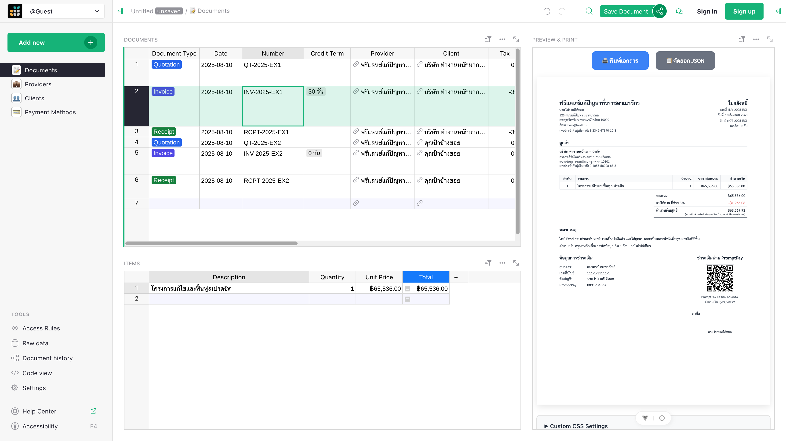

# bizdocgen

A custom [Grist widget](https://support.getgrist.com/widget-custom/) for generating business documents.



Currently supports 3 types of documents:

- **Quotation** (ใบเสนอราคา)
- **Invoice** (ใบแจ้งหนี้)
- **Receipt** (ใบเสร็จรับเงิน)

I use it when dealing with event sponsorships and occasional consulting work, while my friends use it for issuing [business documents related to freelance work](https://mennstudio.com/2014/design-business-forms/).

## Set up

### Hosted Grist (easiest)

This is the easiest way to instantly try it out for free.

1. [**Click here to open the template**](https://bizdocgen.getgrist.com/cq6sb6WHRMre/bizdocgen-template) (no need to sign in).
2. Feel free to make changes (this will [create an unsaved copy](https://support.getgrist.com/glossary/#fiddle-mode) for you to try out).
3. To save it to your own workspace, click **Use This Template** or **Save Copy** (this is where you'll need to sign up or sign in).

> [!TIP]
> Grist has a [generous free tier](https://www.getgrist.com/pricing/) that comes with 5,000 rows per document — more than enough.

### Self-Hosted

For self-managed Grist, download the template file from this repository and import it into your instance:

1. Download the Grist template file: [template.grist](template.grist)
2. Open the template in your Grist account.

> [!TIP]
> You can [self‑host](https://support.getgrist.com/self-managed/) your own Grist instance for better data sovereignty, unlimited rows, and unlimited API rate limit.

## Technology Stack

- **Frontend**: Vue 3 with Composition API + TypeScript
- **Build Tool**: Vite+
- **Package Manager**: pnpm (managed through Vite+)

## Development

Set up [VSCode](https://code.visualstudio.com/) + [Volar](https://marketplace.visualstudio.com/items?itemName=Vue.volar) (disable Vetur)

```bash
# Clone the repository
git clone https://github.com/dtinth/TypeScriptAccount.git
cd TypeScriptAccount

# Install dependencies
vp install

# Start development server
vp dev
```

## License

MIT

## Related Documentation

- [Vite+ Guide](https://viteplus.dev/guide/)
- [Vite Configuration Reference](https://vite.dev/config/)
- [Vue 3 Documentation](https://vuejs.org/)
- [TypeScript Documentation](https://www.typescriptlang.org/)
- [Zod Validation](https://zod.dev/)
- [Grist Custom Widgets Guide](https://support.getgrist.com/widget-custom/)
- [Grist Widget API Reference](https://support.getgrist.com/widget-custom-api/)
- [Grist Templates](https://templates.getgrist.com/)
